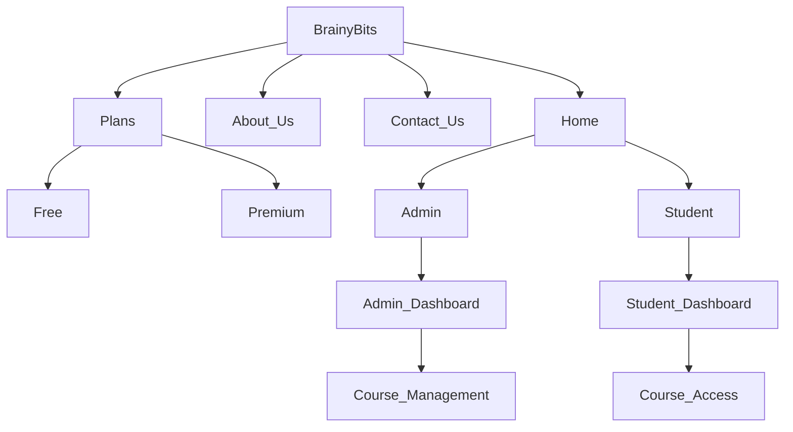

# Code-A-Haunt
# CBP38 - Smart Education, a Concept that Describes learning in the digital age. It enables learners to learn more effectively, efficiently, flexibly, and comfortably.
BrainyBits is an online platform that provides courses for students who are passionate about coding. Whether you are a beginner who's trying to start your journey in the field of programming or a professional who's trying to upskill his skills, we've got you covered. Join BrainyBits now and embark on an exciting journey in the field of coding.
# Features:
The free plan contains access to limited resources. The premium plan offers access to all resources and also free mentorship. 
Students have to login through the registered username and password to get access to the resources. If a student is new, he/she can register easily by providing the required details.

